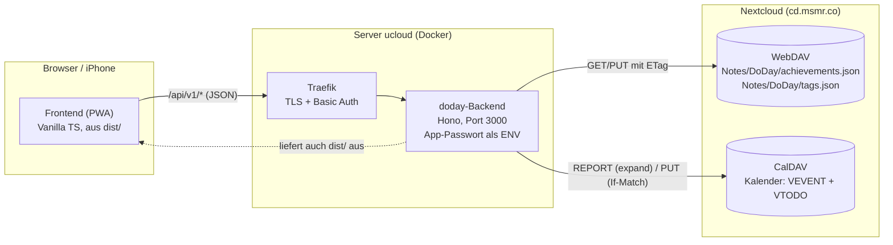
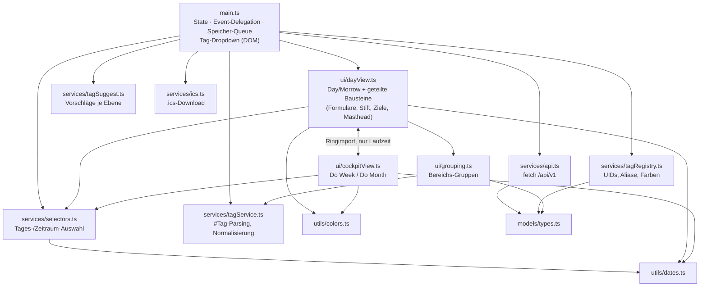
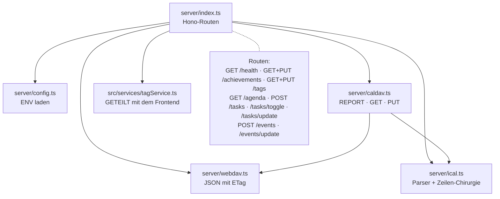
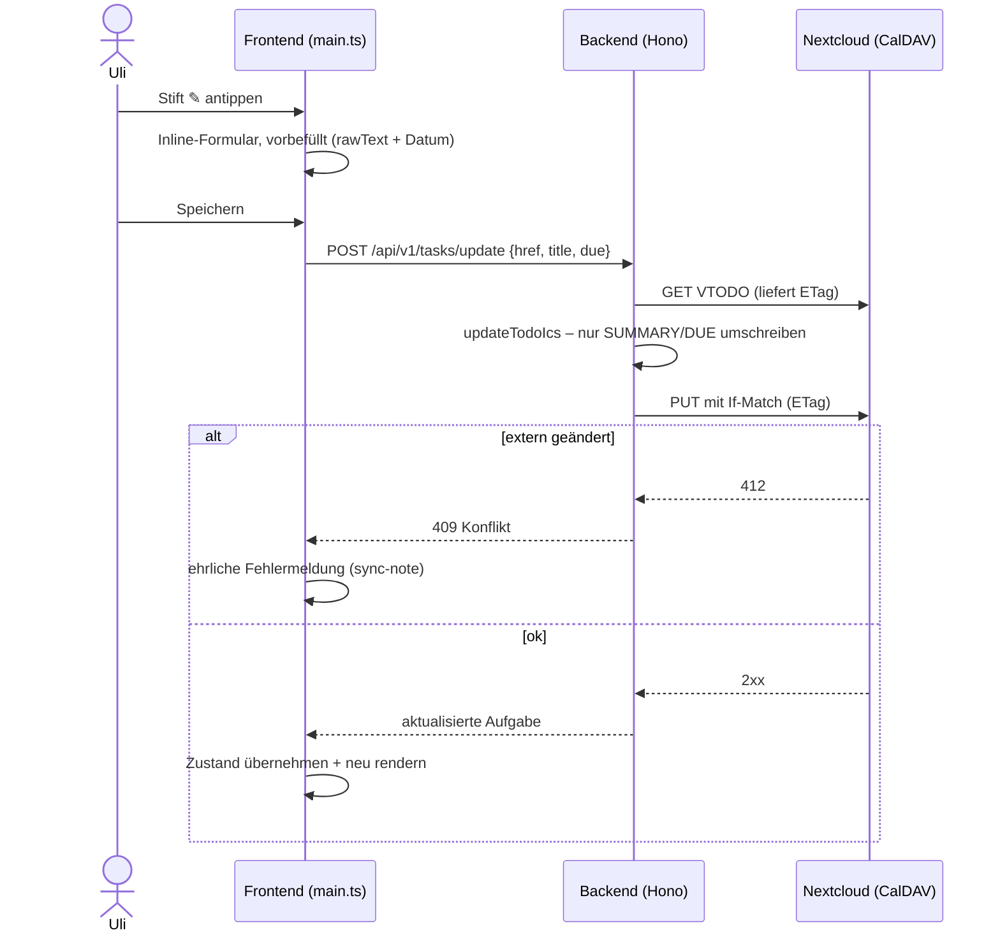

# Do Day – Projektstand

Stand: 13. Juni 2026 · `main` = `05fb117` · 144 Tests grün · live auf https://do.msmr.co

## Erledigt

### Phase 1 – Grundgerüst & Design
- Vite + Vanilla TypeScript, Render-Muster „Zustand → HTML-String → innerHTML",
  Event-Delegation in `main.ts`, Logik TDD-getestet in `services/`
- Vier Tabs (Do Day · Do Morrow · Do Week · Do Month), Light/Dark via
  `prefers-color-scheme`, Desktop zweispaltig, Spalten-Umschalter im Hochformat
- Hierarchische `#Tags` im Klartext (`#Zuhause.Aufräumen`), Tag-Registry mit
  UIDs und Aliasen: Umbenennen (✎) kaskadiert über Unterbereiche, Objekttexte
  bleiben unangetastet; Bereichs-„Sprung" (Filter-Chip)
- Habits mit eigener Farbe + Zahnrad-Editor; Ziele-Sektion mit Pillen-Balken
  und X/Y-Ringen; Habit↔Ziel-Verknüpfung (`habitId`); Erledigt-Zeile

### Phase 2 – Echte Nextcloud-Anbindung
- Hono-Backend (`server/`): App-Passwort bleibt als ENV auf dem Server,
  Browser spricht nur `/api/v1/*` (gleiche Origin, kein CORS)
- WebDAV-Client mit ETag/If-Match: `achievements.json` + `tags.json` werden
  echt geladen/gespeichert (optimistic UI, Speicher-Warteschlange,
  Konflikt → Änderung erneut anwenden, danach ehrlich neu laden)
- Termin als `.ics` für den Geräte-Kalender; Apache-ETag-Falle gelöst
  (`-gzip`-Suffix → Accept-Encoding identity + Normalisierung)

### Phase 3 – CalDAV
- `server/ical.ts` (Mini-iCal-Parser, RRULE expandiert die Nextcloud) und
  `server/caldav.ts` (REPORT/GET/PUT mit ETag)
- `/api/v1/agenda` (Termine + Aufgaben je Zeitfenster), Anlegen von Aufgaben
  (VTODO) und Terminen (VEVENT) direkt in der Nextcloud, Abhaken per
  Zeilen-Chirurgie (nur Status-Zeilen ändern sich)

### Betrieb (12./13. Juni 2026)
- **Ausfall behoben:** Dockerfile kopierte `src/` nicht ins Laufzeit-Image →
  Backend-Crash-Loop → Traefik-404. Fix: `COPY src ./src`
- **Basic Auth** vor do.msmr.co (Traefik-Middleware, bcrypt-Hash via
  `htpasswd -nB`, `$$`-Escaping in Compose)
- **App-Icon** als iOS-Homescreen-Icon (180×180) und Favicon (32×32)

### Phase 4 – Do Week & Do Month (Cockpit)
- Eine gemeinsame Ansicht `ui/cockpitView.ts`, Zeitraum als Parameter
- Habits: Woche = 7 Punkte Mo–So (Klick hakt heute ab), Monat = Bilanz-Balken
  („12 von 30 Tagen", „Ziel 3×/Woche: 11 von 12")
- Ziele-Block wiederverwendet; Aufgaben je Tag mit **Überfällig**-Gruppe;
  Termine als schmale Tageszeilen; Anlegen + Abhaken direkt im Cockpit
- `‹ ›`-Zeitsprung (Vorwoche/-monat, nie in die Zukunft, Tab-Wechsel = jetzt)
  mit Überholer-Wächter gegen verspätete Serverantworten
- Selektoren TDD: `weekRange`, `monthRange`, `datesInRange`, `weeksInRange`,
  `habitDoneInRange`, `tasksByDay`, `eventsByDay`, `isoWeek`

### Phase 5 – Bearbeiten
- Stift im kleinen Kreis (`--hairline`-Hintergrund) hinter jeder Aufgabe und
  jedem **Einzeltermin** (Day + Cockpit); Klick → vorbefülltes Inline-Formular
  (Titel inkl. #Tags, Datum, Zeiten; ganztägige bleiben ganztägig)
- Server: `updateTodoIcs`/`updateEventIcs` (Zeilen-Chirurgie, fremde Felder
  bleiben erhalten), `POST /api/v1/tasks/update` + `/events/update` mit
  ETag-Schutz; **Serien lehnt der Server ab** (Schutz vor Massenänderung)
- Agenda liefert je Termin `href` + `recurring` (Serien-Erkennung)

### Phase 4b – Tag-Vorschläge
- `#` in einem Titel-Feld öffnet ein Dropdown der bekannten Bereiche, jedes
  Zeichen filtert; **vervollständigt wird nur bis zum nächsten `.`** –
  Ebenen mit Unterbereichen enden auf `.` und zeigen sofort die nächste Stufe
- Bedienung: Tipp/Klick, ↑/↓ + Enter, Escape; NFD-Umlaute werden gefunden

### Navi-Leiste als Mini-Icons
- Untere Tasten 1:1 nach dem App-Icon: quadratische Papier-Kachel,
  großes „DO" (Mitte 37,5 %) über dem Wort (Mitte 75 %), Größe über
  `--keycap-size`. Inaktiv = Grau-Tönung (50 %/15 %) + dunkler Schatten;
  aktiv = hell, ohne Tönung, ohne Schatten. Nur „Do Day" hat das Wort +25 %.

## Störungs-Lehren (13.06.2026) – wichtig fürs Deployment

- **Dockerfile musste `COPY src ./src` bekommen** – das Backend importiert
  `src/services/tagService`; ohne `src/` im Laufzeit-Image → Crash-Loop +
  Traefik-404 (Fix: Commit 905ae43).
- **Nextcloud-Datei-Sperre (HTTP 423):** Beim Speichern hängengebliebene
  Sperre der „Temporary files lock"-App (`files_lock`). Lag NICHT in Redis
  (Redis-Flush half nicht), sondern in der DB. Gelöst durch
  `occ app:disable files_lock`. Diese App brauchen wir nicht.
- **DNS-Ausfall des Heimnetzes:** `cd.msmr.co` (split-horizon →
  `ucloud.fritz.box` → `10.0.10.100`) war zeitweise nicht auflösbar, weil der
  Pi-hole-Resolver (`unhole`) wackelte. Dauerhafte Absicherung:
  **`extra_hosts: cd.msmr.co:10.0.10.100`** im `doday`-Service (steht jetzt in
  `deploy/compose.example.yml`) – das **Backend** ist damit vom Heim-DNS entkoppelt.
- **CNAME-auf-IP im Pi-hole = Bug (14.06.2026):** Die CLIENT-Auflösung von
  `do.msmr.co`/`cd.msmr.co` brach am Heimnetz (v. a. iOS), weil im Pi-hole ein
  **CNAME auf eine IP** stand (`ucloud.fritz.box → 10.0.10.100`). Ein CNAME darf
  NUR auf einen Namen zeigen, nie auf eine IP – die Kette endet sonst beim
  Pseudo-Namen `10.0.10.100.` ohne A-Record. macOS/`curl` deuten das nachsichtig
  als IP-Literal (geht „zufällig"), **strikte Resolver (iOS) scheitern**. Fix:
  die zwei CNAME-auf-IP-Einträge (`ucloud.fritz.box→10.0.10.100`,
  `fritz.box→10.0.10.1`) **gelöscht**. Conditional Forwarding (war längst aktiv:
  `10.0.10.0/24 → 10.0.10.1 / fritz.box`) liefert `ucloud.fritz.box` nun als
  echten A-Record von der Fritzbox; die Aliase `*.msmr.co → ucloud.fritz.box`
  (CNAME Name→Name) sind dadurch gültig. **Regel: im Pi-hole IP-Ziele als
  A-Record (Local DNS Records), niemals als CNAME.** `extra_hosts` (oben) betrifft
  nur das Backend und hat mit dieser Client-Auflösung nichts zu tun.
- **PWA-Icon trotz Basic Auth:** zweiter auth-freier Traefik-Router nur für die
  Icon-/Manifest-Dateien (`PathRegexp` `\.(png|json)$`); Beispiel in der Compose.
- **Diagnose-Lehre:** „Speichern fehlgeschlagen – läuft das Backend?" war
  irreführend (es lief). → offener Punkt: ehrlichere Fehlermeldung.

## Offene Punkte

| Thema | Status |
|---|---|
| ~~PWA-Manifest (Vollbild auf dem iPhone)~~ | ✅ erledigt 13.06. – statisches `manifest.json` + apple-Meta-Tags, kein Service Worker (Nutzerwunsch) |
| Verschieben per Drag & Drop | Konzept fertig: `docs/verschieben-konzept.md` (4 Stufen, Pointer Events) – **als Nächstes** |
| Ehrlichere Sync-Fehlermeldung | „läuft das Backend?" war am 13.06. irreführend (Sperre/DNS); Ursache benennen statt pauschal |
| Serientermine bearbeiten | bewusst ausgeklammert – Änderung in der Nextcloud (RECURRENCE-ID wäre nötig) |
| Blättern in die ZUKUNFT (Week/Month) | bewusst weggelassen (YAGNI) – Cockpits zeigen jetzt + Vergangenheit |
| Ziel-Historie | Ziele zeigen immer den aktuellen Stand, auch in Vorzeiträumen (keine Historie gespeichert) |
| Termine-Umzug iCloud → Nextcloud | Nutzer-Aufgabe, noch offen |
| ExApp-Stufe (Nextcloud AppAPI) | Konzept-Option, alles dafür vorbereitet (ENV, /api/v1, keine lokale DB) |
| Kosmetik Cockpit/Stifte | nach Sichtprüfung ggf. Feinschliff (Punktgrößen, Abstände, max. 8 Tag-Treffer) |
| Server-Nebenbefunde | `srv-bluespice-bluespice-1` und `portainer_edge_agent` in Restart-Schleifen, `unhole` unhealthy – unabhängig von Do Day |
| Bewusste Architektur-Eigenheit | Ringimport `dayView ↔ cockpitView` (nur Laufzeit-Aufrufe, unkritisch); Deploy bewusst per `git pull` statt GHCR/Actions |

## Architektur (Mermaid)

### Gesamtbild

### Frontend-Module

### Server-Module & Routen

### Ablauf „Aufgabe bearbeiten" (typisch für alle Schreibwege)

